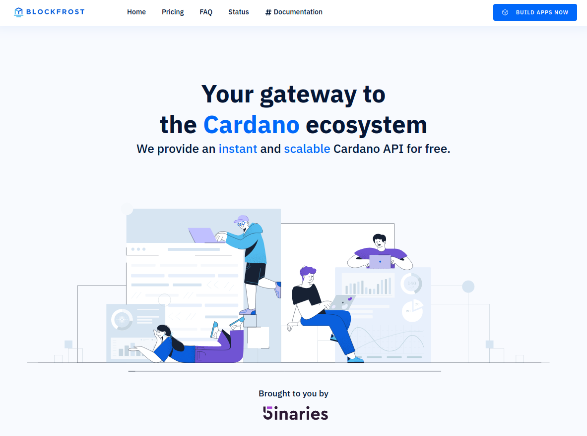

In order to use the hosted API as a Service, you need to create an account first.

# Log in / Sign up

When [creating a Blockfrost.io account](https://blockfrost.io/auth/signin) you can use your email or Single Sing-On through Google, GitHub and GitLab. With an account, you can start building your apps!

:::info
We use password-less login. No need to worry about losing or storing any passwords!
:::

# Creating your project

After setting up your account, proceed to create your first project. Select **+ ADD PROJECT**, choose a suitable name, and ensure you pick the correct network. Upon clicking **SAVE PROJECT**, a unique secret API key, known as `project_id`, will be generated automatically for you.

:::tip
Once the project is created, click on the arrow to expand the view. This will reveal project statistics, as well as a selection of ready-to-use command line samples that update with each refresh.
:::

In Blockfrost, a project signifies API access to a particular network. Each project is linked to a confidential token known as `project_id`, which must be used to access the API. The following sections will provide more information about the available networks.

:::warning
Remember to safeguard your secrets! Since `project_id` is a secret, ensure it is not committed to a public repository or embedded in your code. When feasible, utilize environment variables to prevent exposing `project_id`. Idially, set up your own application backend to store your project_id securely, avoiding potential leaks. Otherwise, unauthorized individuals could exploit your token.
:::

# SDKs

An SDK, or Software Development Kit, is a collection of tools, libraries, and resources that developers use to create, build, and streamline applications for specific platforms. With support for over 15 distinct programming languages, Blockfrost stands out as the most adaptable toolkit for accessing data within the Cardano blockchain.

Some of them are:

<ul>
<li><a href="https://github.com/blockfrost/blockfrost-js">blockfrost-js</a></li>
<li><a href="https://github.com/blockfrost/blockfrost-haskell">blockfrost-haskell</a></li>
<li><a href="https://github.com/blockfrost/blockfrost-python">blockfrost-python</a></li>
<li><a href="https://github.com/blockfrost/blockfrost-rust">blockfrost-rust</a></li>
<li><a href="https://github.com/blockfrost/blockfrost-go">blockfrost-go</a></li>
<li><a href="https://github.com/blockfrost/blockfrost-ruby">blockfrost-ruby</a></li>
<li><a href="https://github.com/blockfrost/blockfrost-java">blockfrost-java</a></li>
<li><a href="https://github.com/blockfrost/blockfrost-scala">blockfrost-scala</a></li>
<li><a href="https://github.com/blockfrost/blockfrost-swift">blockfrost-swift</a></li>
<li><a href="https://github.com/blockfrost/blockfrost-kotlin">blockfrost-kotlin</a></li>
<li><a href="https://github.com/blockfrost/blockfrost-elixir">blockfrost-elixir</a></li>
<li><a href="https://github.com/blockfrost/blockfrost-dotnet">blockfrost-dotnet</a></li>
<li><a href="https://github.com/blockfrost/blockfrost-arduino">blockfrost-arduino</a></li>
<li><a href="https://github.com/blockfrost/blockfrost-php">blockfrost-php</a></li>
<li><a href="https://github.com/blockfrost/blockfrost-crystal">blockfrost-crystal</a></li>
</ul>
